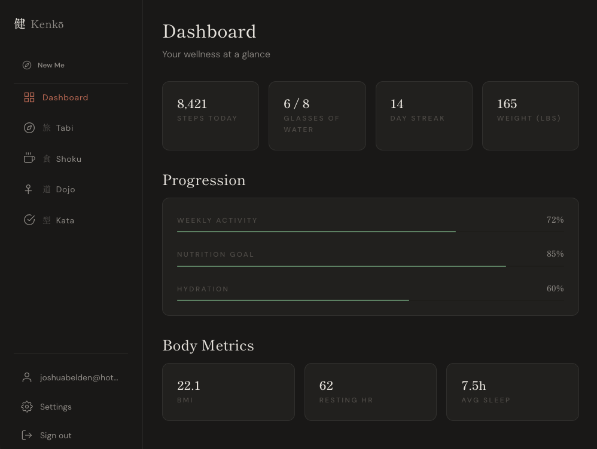

# 健康 · Kenkō

A personal health and wellness application built with SvelteKit. Kenkō brings together nutrition tracking, fitness logging, commitment building, and goal-oriented journeys into a single, focused tool — designed around calm Japanese minimalism rather than the noise of typical fitness apps.



---

## Modules

| Module | Kanji | Purpose |
|---|---|---|
| **Shoku** | 食 | Nutrition diary and food library |
| **Dojo** | 道 | Workout plans, sessions, and exercise library |
| **Kata** | 型 | Commitments — things you are working toward or limiting |
| **Tabi** | 旅 | Journeys — goal-oriented lenses that tie everything together |

### How Journeys work

A Journey is a named period with a start and end date — a marathon training block, a year-long resolution, a 12-week cut. When a Journey is active, all logged data (diary entries, workouts, commitment logs) is automatically tagged to it.

The **journey lens** at the top of the app lets you filter all views to a specific Journey, or switch to a global view that shows everything. Deleting a Journey never deletes your data — only the tag is removed.

New users start with a default Journey called **New Me** spanning one year from signup.

---

## Tech Stack

| Layer | Technology |
|---|---|
| Framework | [SvelteKit](https://kit.svelte.dev/) with Svelte 5 runes |
| Database | [MongoDB Atlas](https://www.mongodb.com/atlas) via native Node.js driver |
| Deployment | [Vercel](https://vercel.com/) |
| Fonts | Shippori Mincho · DM Sans (via Google Fonts) |

---

## Getting Started

### Prerequisites

- Node.js (recent LTS — v20 or v22 recommended)
- npm
- A MongoDB Atlas account and cluster

### 1. Clone the repository

```bash
git clone https://github.com/your-username/kenko.git
cd kenko
```

### 2. Install dependencies

```bash
npm install
```

### 3. Configure environment variables

Create a `.env` file in the project root:

```env
MONGODB_URI=your_mongodb_connection_string
```

Your MongoDB connection string can be found in Atlas under **Database → Connect → Drivers**.

### 4. Seed the exercise library

Kenkō includes a global library of 150 exercises. Run the seed script once before starting the app for the first time:

```bash
npm run seed
```

The script is idempotent — if global exercises already exist in the database it will skip and exit cleanly.

### 5. Start the development server

```bash
npm run dev
```

The app will be available at `http://localhost:5173`.

---

## Project Structure

```
kenko/
├── scripts/
│   └── seed.ts                 # Global exercise seed — run once on setup
├── src/
│   ├── lib/
│   │   ├── server/
│   │   │   └── db.ts           # MongoDB connection
│   │   └── stores/
│   │       └── journeyLens.svelte.ts   # Active journey lens store
│   ├── routes/
│   │   ├── api/
│   │   │   ├── shoku/          # Nutrition API routes
│   │   │   ├── dojo/           # Fitness API routes
│   │   │   ├── kata/           # Commitment API routes
│   │   │   └── journeys/       # Journey API routes
│   │   ├── shoku/              # Nutrition UI
│   │   ├── dojo/               # Fitness UI
│   │   ├── kata/               # Commitments UI
│   │   └── tabi/               # Journeys UI
│   └── app.html
├── .env                        # Local environment variables (not committed)
├── .env.example                # Template for required variables
└── package.json
```

---

## MongoDB Collections

| Collection | Description |
|---|---|
| `journeys` | User journeys with date ranges and status |
| `foodItems` | Saved food items with full nutrition data |
| `diaryEntries` | Daily nutrition logs referencing food items |
| `exercises` | Global (`isGlobal: true`) and user-created exercises |
| `workoutPlans` | Named plans containing sessions and exercises |
| `workoutLogs` | Completed or in-progress workout sessions with set data |
| `commitments` | User commitments with targets, periods, and direction |
| `commitmentLogs` | Daily logs against commitments |

---

## Available Scripts

| Script | Description |
|---|---|
| `npm run dev` | Start development server |
| `npm run build` | Build for production |
| `npm run preview` | Preview production build locally |
| `npm run seed` | Seed global exercise library (run once) |
| `npm run check` | Run Svelte type checking |

---

## Design System

Kenkō uses a warm Japanese minimalist aesthetic — no shadows, no gradients, deliberate whitespace. The full design token reference is documented in [`DESIGN.md`](./DESIGN.md).

Key tokens:

```css
--paper: #f5f2ee;          /* warm off-white background */
--ink: #1a1a1a;            /* primary text */
--accent: #c4543a;         /* vermillion — primary actions, alerts */
--accent-green: #3d6b4f;   /* bamboo — progress, positive states */
```

Full light and dark mode is supported via CSS custom properties. The theme switches automatically based on system preference and can be toggled manually.

---

## Deployment

Kenkō is configured for deployment on Vercel.

```bash
npm run build
```

Set the `MONGODB_URI` environment variable in your Vercel project settings under **Settings → Environment Variables**. The seed script should be run separately against your production database before first deploy — it does not run automatically on build.